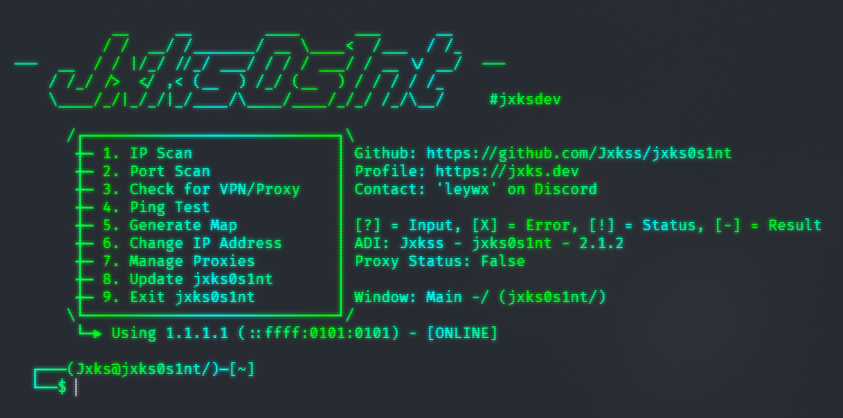

<h1 align="center">
  <br>
  <a href="https://github.com/Jxkss/jxks0s1nt"></a>
  <br>
</h1>

<h4 align="center">Powerful OSINT toolkit for IP analysis.</h4>
 
<p align="center">
  
  &nbsp;&nbsp;
  <a href="https://github.com/Jxkss/jxks0s1nt/">
    
  </a>
  <a href="https://github.com/Jxkss/jxks0s1nt">
    
  </a>
  <a href="https://github.com/Jxkss/jxks0s1nt/blob/main/LICENSE">
    
  </a>
  <a href="https://github.com/Jxkss">
    
  </a>
  &nbsp;&nbsp;
  
</p>


<p align="center">
  
</p>

## Installation

### Prerequisites

- Python 3.7+
- `pip` (Python package installer)

### Clone the Repository

```bash
git clone https://github.com/Jxkss/jxks0s1nt.git
cd jxks0s1nt
```

## Install Required Libraries

Install the required libraries using pip:

```bash
pip install -r requirements.txt
```

## Usage

### Run the Main Script

```bash
python3 main.py
```
### Follow the On-Screen Prompts

- Enter the IP address to analyze.

- Select an option from the menu:
  - `1`: Perform an extensive scan of the IP Address.
  - `2`: Scan the first 10,000 ports of the IP Address.
  - `3`: Check if the IP address is associated with a VPN or proxy.
  - `4`: Ping test for response time measurement.
  - `5`: Approximate Coordinates and Google Maps Link generation.
  - `6`: Switch out the current IP Address for a new one.
  - `7`: Manage the use of Proxies for direct requests to the target IP Address.
  - `8`: Check for updates to make sure you have the latest version of the tool.
  - `9`: Exit the program.


## Features

- **Extensive IP Scanning**: 
  - Quick scan using ip-api.com
  - Detailed scan using ipapi.is with comprehensive data
  - Retrieve location, timezone, network details, and more

- **Network Reconnaissance**:
  - Port scanning of the first 10,000 ports
  - Identification of open services and potential vulnerabilities
  - Asynchronous scanning for improved speed

- **VPN/Proxy Detection**:
  - Identify if an IP is associated with VPN services
  - Detect proxy usage and anonymization attempts
  - Assess IP reputation and potential abuse indicators

- **Geolocation Features**:
  - Approximate latitude and longitude coordinates
  - Interactive Google Maps integration
  - One-click map generation for visual location tracking [Currently Unavailable]

- **Network Diagnostics**:
  - Ping testing with response time measurement
  - IP status verification
  - Connection quality assessment

- **Proxy Management**:
  - Use proxies for anonymous scanning
  - Automatic proxy testing and selection
  - Proxy rotation capabilities

- **User-Friendly Interface**:
  - Color-coded terminal output
  - Clear status indicators and results formatting
  - Interactive menu system
  
## License

This project is licensed under the MIT License. See the LICENSE file for details.

## Contact

For any inquiries, contact `leywx` on Discord.

## Acknowledgements

- [ip-api](https://ip-api.com/) for an IP information API.
- [ipapi.is](https://ipapi.is/) for another IP information API.
- [IPQualityScore](https://ipqualityscore.com/) for the VPN/proxy detection API.

---

**Disclaimer**: This tool is intended for educational and ethical testing purposes only. Unauthorized use of this tool for attacking targets without prior mutual consent is illegal and punishable by law.
